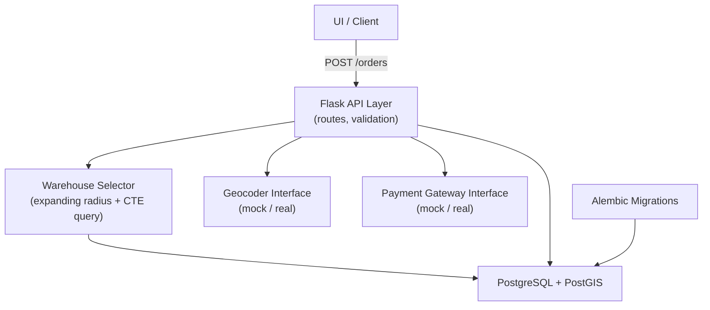
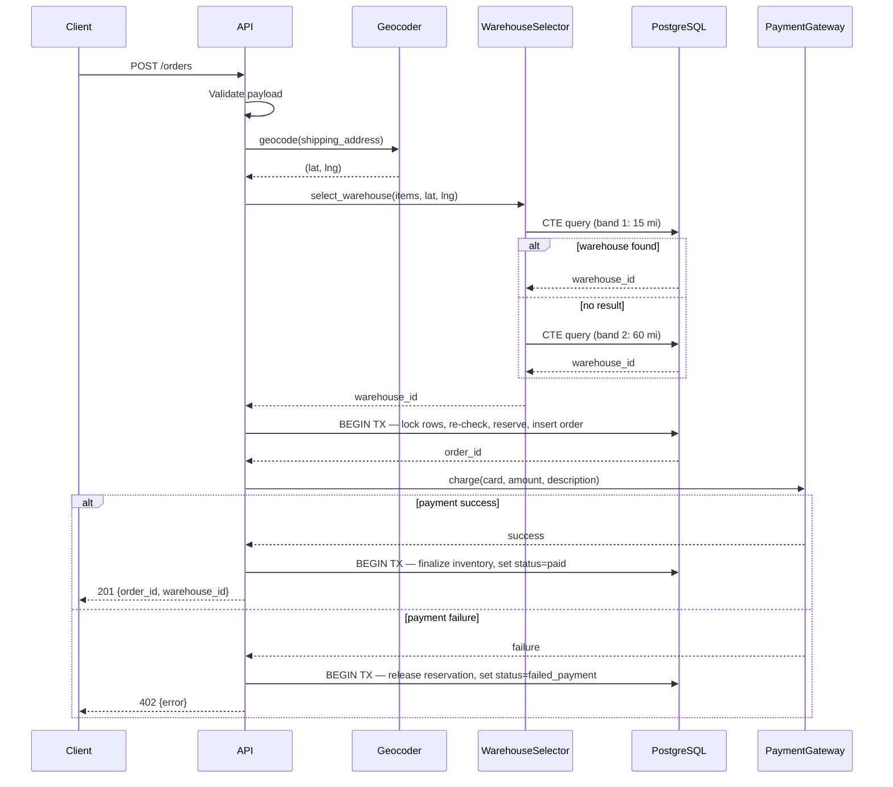
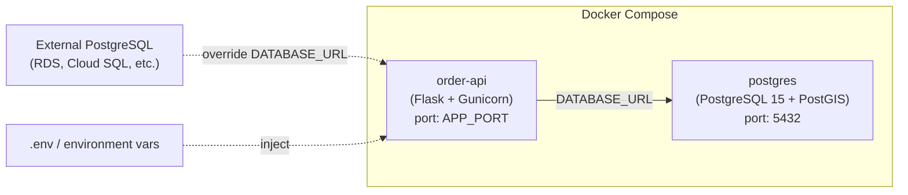

# Design Document: Order Management API

## Overview

The Order Management API is a Flask-based backend service that accepts order creation requests, selects the optimal warehouse to fulfill the order, reserves inventory, and processes payment. The system is designed to operate at scale (millions of products and warehouses) while completing the full order creation flow within 5 seconds.

### Key Design Principles

- **Inventory-first, distance-second**: Candidate warehouses are filtered by full-order fulfillability before any geospatial ranking. This avoids selecting a nearby warehouse that cannot actually ship the order.
- **Expanding radius search**: Geospatial queries fan out in discrete bands (15 mi → 60 mi → 300 mi → nationwide), stopping as soon as a qualifying warehouse is found within the current band. All radius values are expressed in miles and converted to meters internally for PostGIS (`1 mile = 1,609.344 meters`).
- **Manufacturer country filter**: Products carry an ISO 3166-1 alpha-2 `manufacturer_country` code. Orders may optionally specify a list of acceptable country codes; the warehouse selector adds this as a filter on the CTE join. Omitting the field applies no restriction, making the feature fully backward-compatible and multi-country by design.
- **Reservation model**: `reserved_qty` is incremented on order placement; `available_qty` is only decremented after confirmed payment. This prevents permanent stock loss for failed payments.
- **Payment outside the transaction**: The payment gateway call happens after the DB transaction commits, so no long-held locks block concurrent orders during a network call.
- **Swappable interfaces**: Geocoder and Payment Gateway are defined as abstract interfaces, making it trivial to swap mock implementations for real providers.

---

## Architecture

### High-Level Component Diagram



### Request Lifecycle



### Deployment Architecture



The `order-api` service connects to whichever PostgreSQL instance is specified in `DATABASE_URL`. By default this points to the bundled `postgres` container, but overriding `DATABASE_URL` in the environment (or a `.env` file) is all that's needed to point to any external PostgreSQL instance — no code or image changes required.

**Docker Compose services:**

| Service | Image | Purpose |
|---|---|---|
| `order-api` | built from `./Dockerfile` | Flask + Gunicorn application |
| `postgres` | `postgis/postgis:15-3.4` | PostgreSQL 15 with PostGIS extension pre-installed |

The `postgres` service exposes port `5432` on localhost for local development tooling (e.g. psql, DBeaver). The `order-api` service depends on `postgres` with a healthcheck so it only starts once the database is ready.

Alembic migrations run automatically on container startup via an entrypoint script (`alembic upgrade head`) before Gunicorn starts.

---

## Components and Interfaces

### 1. Flask API Layer (`app/routes/orders.py`)

Responsible for HTTP request/response handling, input validation, and orchestrating the order creation flow.

**Endpoint**: `POST /orders`

Request body:
```json
{
  "customer_id": "string",
  "shipping_address": "string",
  "manufacturer_countries": ["US", "DE"],
  "items": [
    { "sku": "string", "quantity": 1 }
  ]
}
```

`customer_id` is required. The service uses it to look up the customer's stored payment information — no card number is accepted in the request payload.

`manufacturer_countries` is optional. Omit it (or pass `null`) to apply no restriction. Pass one or more ISO 3166-1 alpha-2 country codes (e.g. `["US", "DE"]`) to restrict fulfillment to products manufactured in those countries.

Response (201):
```json
{
  "order_id": "uuid",
  "warehouse_id": "uuid",
  "status": "paid",
  "total_amount": 99.99
}
```

Error response (all error codes):
```json
{
  "error": "human-readable message"
}
```

### 2. Geocoder Interface (`app/services/geocoder.py`)

```python
class GeocoderInterface(ABC):
    @abstractmethod
    def geocode(self, address: str) -> tuple[float, float]:
        """Returns (latitude, longitude) or raises GeocodingError."""
```

`MockGeocoder` returns a deterministic coordinate derived from the address string (suitable for testing and local development).

### 3. Payment Gateway Interface (`app/services/payment.py`)

```python
class PaymentGatewayInterface(ABC):
    @abstractmethod
    def charge(self, card_number: str, amount: Decimal, description: str) -> PaymentResult:
        """Returns PaymentResult(success, provider_ref, error_message)."""
```

`MockPaymentGateway` accepts any card number and returns success unless the card number matches a configured failure pattern (e.g. `"4000000000000002"`).

### 4. Customer Payment Store (`app/services/customer_payment_store.py`)

```python
class CustomerPaymentStoreInterface(ABC):
    @abstractmethod
    def get_card_number(self, customer_id: str) -> str:
        """Returns the stored credit card number for the customer,
        or raises NoPaymentMethodError if none is on file."""
```

`MockCustomerPaymentStore` holds an in-memory dict of `customer_id → card_number`, seeded from a fixture file. This represents a real-world payment vault or tokenization service — the Order_Service never receives or stores raw card numbers from the client.

### 5. Warehouse Selector (`app/services/warehouse_selector.py`)

Core algorithm component. Executes the expanding-radius CTE query against PostgreSQL.

```python
MILES_TO_METERS = 1_609.344

class WarehouseSelector:
    # Search bands expressed in miles; converted to meters for PostGIS
    SEARCH_BANDS_MILES = [15, 60, 300, None]  # None = nationwide

    def select(
        self,
        items: list[OrderItem],
        lat: float,
        lng: float,
        conn: Connection,
        manufacturer_countries: list[str] | None = None,
    ) -> UUID | None:
        for band_miles in self.SEARCH_BANDS_MILES:
            radius_meters = band_miles * MILES_TO_METERS if band_miles else None
            result = self._query_band(items, lat, lng, radius_meters, manufacturer_countries, conn)
            if result:
                return result
        return None
```

Each band executes the CTE query described in the Data Models section. `None` radius omits the `ST_DWithin` filter, performing a nationwide KNN scan. When `manufacturer_countries` is `None` or empty, the country filter clause is omitted entirely.

### 6. Order Service (`app/services/order_service.py`)

Orchestrates the full order creation flow:

1. Validate payload (`customer_id`, `shipping_address`, `items`, optional `manufacturer_countries`)
2. Geocode address
3. Run warehouse selection (read-only, outside transaction)
4. Open DB transaction → lock inventory rows → re-check availability → increment `reserved_qty` → insert `orders` + `order_items` (status=`pending_payment`) → commit
5. Look up customer's card number via `CustomerPaymentStore` (outside transaction)
6. If no payment method on file → release reservation → return 422
7. Call payment gateway with retrieved card number (outside transaction)
8. On success → open transaction → decrement `available_qty` + `reserved_qty` → set `status=paid` → commit
9. On failure → open transaction → decrement `reserved_qty` → set `status=failed_payment` → commit → return 402

### 7. Configuration (`app/config.py`)

All configuration is read from environment variables at startup. Missing required variables cause the process to log an error and exit with code 1.

| Variable | Required | Description |
|---|---|---|
| `DATABASE_URL` | yes | PostgreSQL connection string — defaults to the bundled `postgres` container; override to point to any external PostgreSQL instance |
| `APP_PORT` | no (default 5000) | Port Flask listens on |

---

## Data Models

### Database Schema

```sql
CREATE EXTENSION IF NOT EXISTS postgis;

CREATE TABLE warehouses (
    id          UUID PRIMARY KEY DEFAULT gen_random_uuid(),
    name        TEXT NOT NULL,
    address     TEXT NOT NULL,
    location    GEOGRAPHY(Point, 4326) NOT NULL,
    active      BOOLEAN NOT NULL DEFAULT true
);

CREATE TABLE products (
    id                   UUID PRIMARY KEY DEFAULT gen_random_uuid(),
    sku                  TEXT NOT NULL UNIQUE,
    name                 TEXT NOT NULL,
    manufacturer_country CHAR(2) NOT NULL  -- ISO 3166-1 alpha-2, e.g. 'US', 'DE'
);

CREATE TABLE warehouse_inventory (
    warehouse_id  UUID NOT NULL REFERENCES warehouses(id),
    product_id    UUID NOT NULL REFERENCES products(id),
    available_qty INTEGER NOT NULL DEFAULT 0 CHECK (available_qty >= 0),
    reserved_qty  INTEGER NOT NULL DEFAULT 0 CHECK (reserved_qty >= 0),
    updated_at    TIMESTAMPTZ NOT NULL DEFAULT now(),
    PRIMARY KEY (warehouse_id, product_id)
);

CREATE TABLE orders (
    id               UUID PRIMARY KEY DEFAULT gen_random_uuid(),
    customer_name    TEXT NOT NULL,
    shipping_address TEXT NOT NULL,
    shipping_lat     DOUBLE PRECISION NOT NULL,
    shipping_lng     DOUBLE PRECISION NOT NULL,
    warehouse_id     UUID NOT NULL REFERENCES warehouses(id),
    status           TEXT NOT NULL CHECK (status IN (
                         'pending_payment', 'paid',
                         'failed_payment', 'cancelled')),
    total_amount     NUMERIC(12, 2) NOT NULL,
    created_at       TIMESTAMPTZ NOT NULL DEFAULT now()
);

CREATE TABLE order_items (
    order_id    UUID NOT NULL REFERENCES orders(id),
    product_id  UUID NOT NULL REFERENCES products(id),
    quantity    INTEGER NOT NULL CHECK (quantity > 0),
    unit_price  NUMERIC(12, 2) NOT NULL,
    PRIMARY KEY (order_id, product_id)
);

CREATE TABLE payments (
    id           UUID PRIMARY KEY DEFAULT gen_random_uuid(),
    order_id     UUID NOT NULL REFERENCES orders(id),
    status       TEXT NOT NULL,
    amount       NUMERIC(12, 2) NOT NULL,
    provider_ref TEXT,
    created_at   TIMESTAMPTZ NOT NULL DEFAULT now()
);
```

### Critical Indexes

```sql
-- Geospatial index for ST_DWithin and <-> KNN
CREATE INDEX warehouses_location_gix
    ON warehouses USING GIST (location);

-- Sparse covering index: inventory lookup by product (for CTE inner join)
CREATE INDEX wi_product_warehouse_instock_idx
    ON warehouse_inventory (product_id, warehouse_id)
    INCLUDE (available_qty, reserved_qty)
    WHERE available_qty > 0;

-- Sparse covering index: inventory lookup by warehouse (for reservation locking)
CREATE INDEX wi_warehouse_product_instock_idx
    ON warehouse_inventory (warehouse_id, product_id)
    INCLUDE (available_qty, reserved_qty)
    WHERE available_qty > 0;
```

The partial indexes (`WHERE available_qty > 0`) keep the index small by excluding rows for out-of-stock products, which is the common case at scale.

### Core Fulfillment SQL (CTE Pattern)

Radius bands are defined in miles in application code and converted to meters before being passed to PostGIS (`radius_meters = miles * 1609.344`).

```sql
WITH requested(product_id, qty) AS (
    VALUES
        (:product_id_1::uuid, :qty_1::int),
        (:product_id_2::uuid, :qty_2::int)
        -- ... one row per line item
),
candidate_warehouses AS (
    SELECT wi.warehouse_id
    FROM warehouse_inventory wi
    JOIN requested r
      ON r.product_id = wi.product_id
     AND (wi.available_qty - wi.reserved_qty) >= r.qty
    JOIN products p ON p.id = wi.product_id
    -- Country filter: omitted entirely when manufacturer_countries is NULL/empty
    -- When provided, only rows whose product manufacturer_country is in the allowed set pass through
    WHERE (:countries_filter IS NULL OR p.manufacturer_country = ANY(:countries_filter::char(2)[]))
    GROUP BY wi.warehouse_id
    HAVING COUNT(*) = (SELECT COUNT(*) FROM requested)
)
SELECT w.id
FROM warehouses w
JOIN candidate_warehouses c ON c.warehouse_id = w.id
WHERE w.active = true
  AND (
      :radius_meters IS NULL
      OR ST_DWithin(
             w.location,
             ST_SetSRID(ST_MakePoint(:lng, :lat), 4326)::geography,
             :radius_meters   -- meters, converted from miles in app layer
         )
  )
ORDER BY w.location <-> ST_SetSRID(ST_MakePoint(:lng, :lat), 4326)::geography
LIMIT 1;
```

**Query plan walkthrough**:
1. `requested` CTE materializes the line items as a values list — no table scan.
2. `candidate_warehouses` uses `wi_product_warehouse_instock_idx` to find warehouses stocking each product with sufficient net stock. The `JOIN products` + `WHERE manufacturer_country = ANY(:countries_filter)` filters out products not manufactured in the requested countries — this join is index-only on `products.id` (PK). When `countries_filter` is `NULL`, the `WHERE` clause is omitted and no join penalty is paid.
3. The `HAVING COUNT(*) = N` ensures all N products are available at the same warehouse.
4. The outer query joins candidates against `warehouses`, applies the `ST_DWithin` radius filter (using `warehouses_location_gix`), and orders by KNN distance (`<->`), returning the single nearest qualifying warehouse.

### Inventory State Machine

```
available_qty  reserved_qty   Event
─────────────────────────────────────────────────────────────────
     100            0         Initial stock
     100           10         Order placed (reserve 10)
      90            0         Payment success (deduct 10 from both)
     100            0         Payment failure (release 10 from reserved only)
```

### Python Data Classes

```python
@dataclass
class OrderItem:
    sku: str
    quantity: int

@dataclass
class CreateOrderRequest:
    customer_id: str
    shipping_address: str
    items: list[OrderItem]
    manufacturer_countries: list[str] | None = None  # ISO 3166-1 alpha-2 codes, None = no restriction

@dataclass
class PaymentResult:
    success: bool
    provider_ref: str | None
    error_message: str | None
```

---

## Correctness Properties

*A property is a characteristic or behavior that should hold true across all valid executions of a system — essentially, a formal statement about what the system should do. Properties serve as the bridge between human-readable specifications and machine-verifiable correctness guarantees.*


### Property 1: Valid order creation response shape

*For any* valid order payload (non-empty customer name, resolvable address, at least one line item with positive quantity, sufficient inventory in at least one warehouse), the API should return HTTP 201 with a JSON body containing `order_id` and `warehouse_id`.

**Validates: Requirements 1.1**

### Property 2: Invalid payload rejected with structured error

*For any* request payload that is missing a required field (customer_name, shipping_address, items), contains an empty string for a required field, or contains a line item with quantity ≤ 0, the API should return HTTP 400 with a JSON body containing an `error` field that identifies the invalid field.

**Validates: Requirements 1.2, 1.3, 2.3**

### Property 3: Order persistence round-trip

*For any* successfully created order, querying the database for that order_id should return a record with all required fields populated: order_id, customer_name, shipping_address, shipping_lat, shipping_lng, warehouse_id, status, total_amount, created_at, and at least one order_item with product_id and quantity > 0.

**Validates: Requirements 2.1, 2.2, 3.1**

### Property 4: Warehouse selection only picks fulfillable warehouses

*For any* order and any warehouse returned by the selector, that warehouse must have `available_qty - reserved_qty >= requested_qty` for every line item in the order at the time of selection.

**Validates: Requirements 4.1, 6.2**

### Property 5: Expanding radius selects nearest warehouse in earliest band

*For any* set of candidate warehouses at known distances from the shipping coordinates, the selector should return the warehouse in the smallest distance band that contains at least one fulfillable warehouse, and within that band it should return the geographically nearest one.

**Validates: Requirements 4.2, 4.3, 4.4**

### Property 6: Reservation invariant on order placement

*For any* successfully placed order, the `available_qty` of each ordered product at the selected warehouse should be unchanged from its pre-order value, and `reserved_qty` should have increased by exactly the ordered quantity.

**Validates: Requirements 6.1**

### Property 7: Payment success finalizes inventory and sets status

*For any* order where the payment gateway returns success, the final state should be: `available_qty` decremented by the ordered quantity, `reserved_qty` decremented by the ordered quantity, and order status set to `paid`.

**Validates: Requirements 6.3, 7.2**

### Property 8: Payment failure releases reservation and sets status

*For any* order where the payment gateway returns failure, the final state should be: `available_qty` unchanged from its pre-order value, `reserved_qty` returned to its pre-order value, order status set to `failed_payment`, and the API response should be HTTP 402.

**Validates: Requirements 6.4, 7.3**

### Property 9: All error responses are JSON with an error field

*For any* request that results in an error response (4xx or 5xx), the response body should be valid JSON containing at least an `error` key with a non-empty string value.

**Validates: Requirements 9.1**

### Property 10: Successful order emits structured log entry

*For any* successfully created order, the application log output should contain a structured entry at INFO level with fields `order_id`, `warehouse_id`, and `processing_time_ms`.

**Validates: Requirements 9.3**

### Property 11: Manufacturer country filter is respected

*For any* order with `manufacturer_countries` set to a non-empty list, every product in every line item of the fulfilled order must have a `manufacturer_country` value that is in the requested list. If no warehouse stocks all requested products with matching countries, the API should return 422.

**Validates: Requirements 10.3, 10.5**

### Property 12: No country filter means no restriction

*For any* order where `manufacturer_countries` is omitted or null, the warehouse selection result should be identical to a query with no country filter applied — i.e., products from any manufacturer country are eligible.

**Validates: Requirements 10.2**

### Property 13: Card number is never accepted in the request payload

*For any* POST /orders request, the presence of a `card_number` field in the payload should have no effect — the service must retrieve payment info via the Customer_Payment_Store using `customer_id` and must not use any card number supplied directly in the request.

**Validates: Requirements 7.4**

### Property 14: No payment method on file returns 422

*For any* order where the Customer_Payment_Store returns no payment method for the given `customer_id`, the API should return HTTP 422 with a JSON body containing an `error` field, and no inventory reservation should remain active.

**Validates: Requirements 7.2**

---

## Error Handling

### HTTP Status Code Map

| Condition | Status | Error message pattern |
|---|---|---|
| Missing / invalid request field | 400 | `"field 'X' is required"` / `"quantity must be > 0"` |
| Invalid `manufacturer_countries` value | 400 | `"invalid country code: 'X'; expected ISO 3166-1 alpha-2"` |
| Address cannot be geocoded | 422 | `"could not geocode address: <address>"` |
| No payment method on file | 422 | `"no payment method on file for customer: <customer_id>"` |
| No warehouse can fulfill order | 422 | `"no warehouse available to fulfill this order"` |
| Payment declined | 402 | `"payment failed: <gateway reason>"` |
| Unhandled exception | 500 | `"an internal error occurred"` |

### Exception Hierarchy

```
OrderServiceError (base)
├── ValidationError          → 400
├── GeocodingError           → 422
├── NoWarehouseAvailableError → 422
└── PaymentError             → 402
```

All exceptions are caught by a Flask error handler registered in the application factory. Unhandled exceptions are caught by a catch-all handler that logs the full traceback at ERROR level and returns 500 with a generic message.

### Concurrency and Retry

When the inventory re-check inside the reservation transaction fails (another order grabbed the last stock between warehouse selection and locking), the service raises an `InventoryConflictError`. The order service catches this and retries the full warehouse selection + reservation flow up to **3 times** before returning 422. This handles the common case of a single concurrent order without exposing retry complexity to the client.

```
select_warehouse() → reserve() → [InventoryConflictError] → retry (up to 3x) → 422
```

---

## Testing Strategy

### Dual Testing Approach

Both unit tests and property-based tests are required. They are complementary:

- **Unit tests** cover specific examples, integration points, and error paths that are hard to express as universal properties (e.g. geocoding failure, missing env var at startup, 500 on unhandled exception).
- **Property-based tests** verify universal invariants across randomly generated inputs, catching edge cases that hand-written examples miss.

### Property-Based Testing

**Library**: [`hypothesis`](https://hypothesis.readthedocs.io/) (Python)

Each correctness property from the design document maps to exactly one `@given`-decorated test. Tests are configured to run a minimum of 100 examples per property.

Each test is tagged with a comment in the format:
```
# Feature: order-management-api, Property N: <property_text>
```

Example:

```python
from hypothesis import given, settings
from hypothesis import strategies as st

# Feature: order-management-api, Property 2: Invalid payload rejected with structured error
@given(
    customer_name=st.one_of(st.just(""), st.none()),
    items=st.lists(
        st.fixed_dictionaries({"sku": st.text(), "quantity": st.integers(max_value=0)}),
        min_size=0, max_size=3
    )
)
@settings(max_examples=100)
def test_invalid_payload_returns_400_with_error_field(client, customer_name, items):
    payload = {"customer_name": customer_name, "shipping_address": "123 Main St", "items": items}
    response = client.post("/orders", json=payload)
    assert response.status_code == 400
    assert "error" in response.get_json()
```

### Unit Test Coverage

Unit tests should focus on:

- Specific geocoding failure path (3.2) — configure mock geocoder to raise `GeocodingError`
- No warehouse available after all bands exhausted (4.5) — empty inventory fixture
- Concurrent reservation conflict retry (6.5) — mock DB to fail first reservation attempt
- Missing required env var at startup (8.4) — subprocess test checking exit code
- Unhandled exception returns 500 with generic message (9.2) — inject a route that raises

### Test Infrastructure

- **pytest** as the test runner
- **pytest-flask** for the Flask test client
- **factory_boy** or plain fixtures for generating test data
- **SQLAlchemy** test transactions rolled back after each test (no persistent state between tests)
- A `conftest.py` provides a `client` fixture wired to an in-memory or test-schema PostgreSQL instance (via `DATABASE_URL` env var pointing to a test DB)
- Mock geocoder and mock payment gateway are injected via the application factory in test mode
